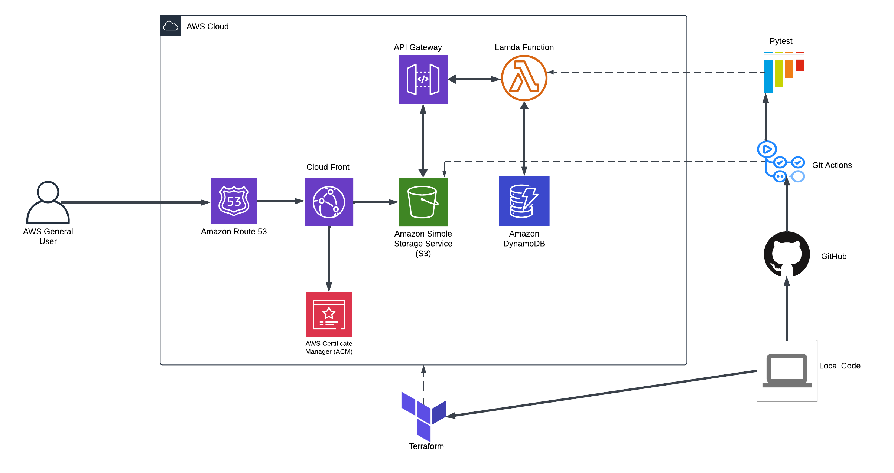

# Cloud Resume Challenge

The Cloud Resume Challenge is all about bringing your resume to life online while getting real-world experience with cloud tech. It walks you through creating, deploying, and managing a website that showcases your skills—all built on the cloud. It’s a fun way to dive into cloud architecture, coding, and automation and come out with a live project to show off your abilities.

## Table of Contents
- [Benefits of the Challenge](#benefits-of-the-challenge)
- [Challenge Stages](#challenge-stages)
  - [Stage 0 - Certification](#stage-0---certification)
  - [Stage 1 - Creating Front End](#stage-1---creating-front-end)
    - [1.1 HTML](#11-html)
    - [1.2 CSS](#12-css)
    - [1.3 JavaScript](#13-javascript)
    - [1.4 Static Assets](#14-static-assets)
    - [1.5 CloudFront](#15-cloudfront)
  - [Stage 2 - Building the API](#stage-2---building-the-api)
    - [2.1 Database](#21-database)
    - [2.2 API](#22-api)
    - [2.3 Python](#23-python)
  - [Stage 3 - Frontend & Backend Integration](#stage-3---frontend--backend-integration)
    - [3.1 Dynamic Counter Value](#31-dynamic-counter-value)
  - [Stage 4 - Automation & CI/CD](#stage-4---automation--cicd)
    - [4.1 Infrastructure as Code (IaC)](#41-infrastructure-as-code-iac)
    - [4.2 CI/CD](#42-cicd)
    - [4.3 Monitoring](#43-monitoring)

---

## Benefits of the Challenge

The Cloud Resume Challenge offers practical experience in building, deploying, and managing a cloud-based project. It enables you to demonstrate your skills in cloud architecture, development, and automation through a hands-on project that showcases your resume online.

---

## Challenge Stages

### Stage 0 - Certification

I earned my AWS CCP and SAA before I found this challenge on reddit. Here you can view my credly badges [CCP](https://www.credly.com/badges/8809e859-ec32-4184-874a-1d51d9f8b700/public_url) , [SAA](https://www.credly.com/badges/18b2645c-b01b-4e24-a5e9-e6e63bea93e4/public_url).

### Stage 1 - Creating Front End

#### 1.1 HTML
I utilised a free Youtube html course.

#### 1.2 CSS
Similar to the previous step I utilised a free Youtube course on css.
- After that I decided to download a template and edit it to my needs.

#### 1.3 JavaScript
Created a simple script.js for the website to use my apigateway for the visitor count.
#### 1.4 Static Assets
Stored my webfiles in an S3 bucket but didnt launch it as a static website. I used OAI to only allow Cloudfront to access the objects.
#### 1.5 CloudFront
I created a Cloudfront Distribution to help distribute my static website, improve load times and provide global availability.
- Cloudfront also helps to redirect http requests to https
### Stage 2 - Building the API

#### 2.1 Database
I setup a DynamoDB database. Here the visitor counter is saved and retrieved from a single Table.There is a single Item in the table which gets constantly updated when a new visitor opens the site.
#### 2.2 API
I setup an REST API using API Gateway that the website talks to. It is set with a POST route, proxying request to a Lambda function responsible for updating a visitor counter and a GET route to retrieve the new updated number in the database.
#### 2.3 Python
I used Python to create my Lambda function which also utilizes boto3 library for aws

### Stage 3 - Frontend & Backend Integration

#### 3.1 Dynamic Counter Value
Integrated the frontend with the backend by adding the script.js I made, to call the API and display the view count dynamically on the site.

### Stage 4 - Automation & CI/CD

#### 4.1 Infrastructure as Code (IaC)
I used Terraform to define and deploy my cloud resources automatically.

#### 4.2 CI/CD
I setup a Github Actions Workflow for the front-end and back-end.
- For the front-end the github action is able to sync the front end files locally to the s3 bucket when I make a push to github and invalidates the cloudfront.

- For the back-end the github action tests my lambda code first makes a zipfile to send to AWS.

#### 4.3 Monitoring
Implement monitoring using Cloudwatch to monitor API requests.

---

#### Stage 5 - BLOG POST
 - I Created a blog post in my website blog page you can view my site and blog page  [here](https://portfolio.shoiyan.com).

